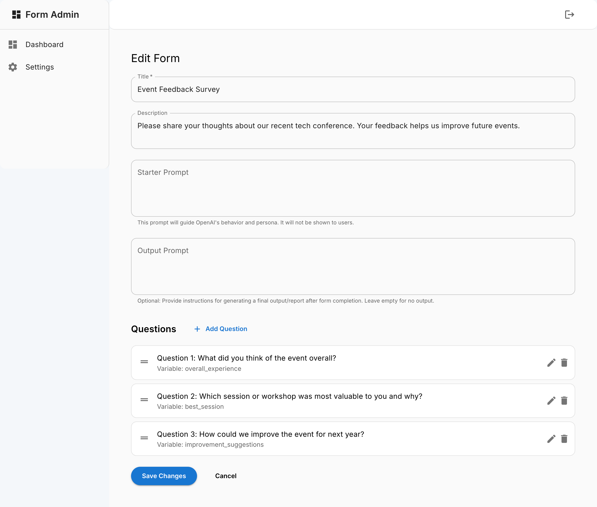
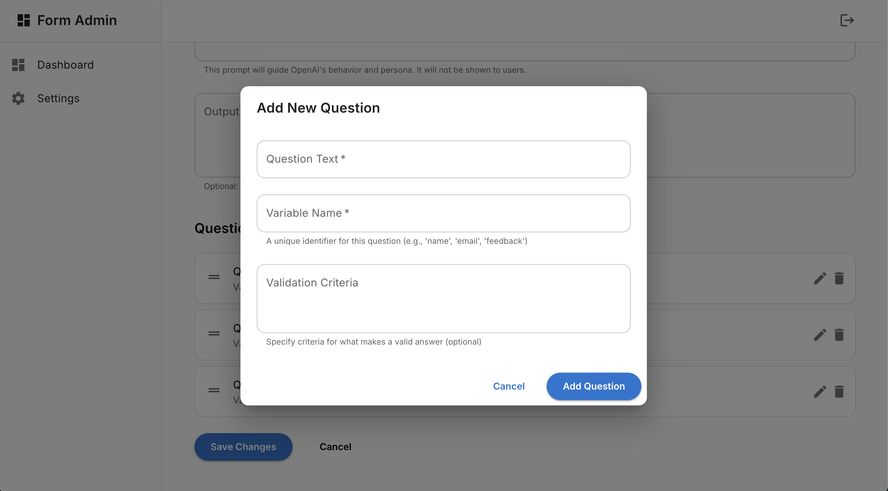
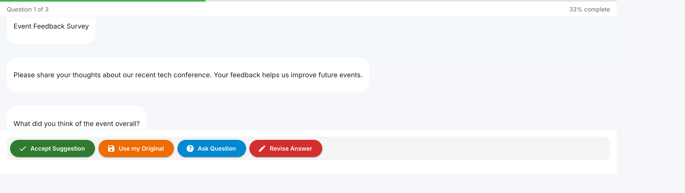
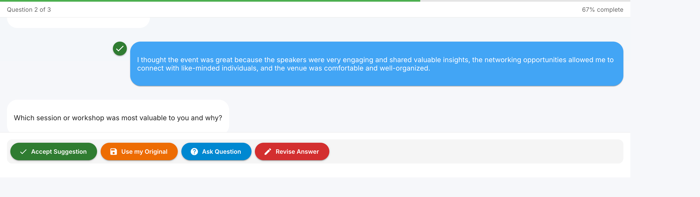
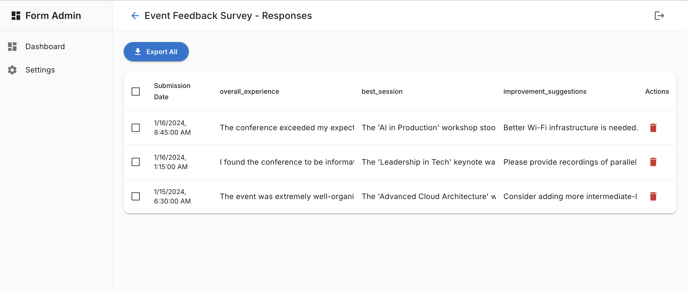
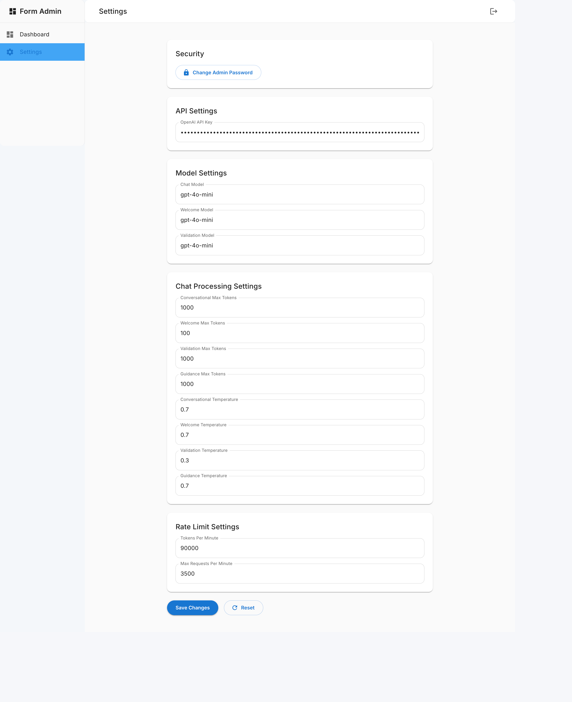

# FormChat

🤖 Transform your boring forms into engaging conversations! FormChat is an AI-powered form builder that turns traditional form-filling into natural, dynamic chat experiences. Say goodbye to rigid form fields and hello to conversational data collection that users actually enjoy.

For more solutions check out my GenAI Secret Sauce site: https://genaisecretsauce.com 

## ✨ Why FormChat?

- **Natural Conversations**: Instead of cold, impersonal forms, users engage in friendly chats that feel natural and engaging
- **AI-Powered Intelligence**: Our AI validates responses in real-time, ensuring high-quality data while guiding users
- **Smart Validation**: Custom validation rules that work behind the scenes to ensure you get exactly the data you need
- **Flexible & Powerful**: From simple contact forms to complex surveys, FormChat adapts to your needs
- **Export Ready**: All responses are neatly organized and ready for analysis - no mess, no stress!

## 🚀 Key Features

- **Conversational Magic**: Transform any form into an engaging chat experience
- **AI Brain**: Smart response validation ensures quality data collection
- **Easy Form Building**: Create forms in minutes with our intuitive builder
- **Real-time Insights**: Watch responses flow in and export when ready
- **Enterprise Ready**: Secure authentication, rate limiting, and data protection built-in
- **Developer Friendly**: Clean API, great docs, easy integration

## 🎯 Perfect For

- Customer Feedback & Surveys
- Job Applications
- User Research
- Lead Generation
- Support Intake
- Any form that needs a human touch!

## Documentation

### Getting Started
- [Installation Guide](docs/installation.md)
- [Quick Start Guide](docs/quickstart.md)
- [Configuration Guide](docs/configuration.md)
- [User Guide](docs/userguide.md)
- [Project Overview](docs/index.md)

### Core Features
- [AI Integration](docs/features/ai.md)
- [Chat Interface](docs/features/chat.md)
- [Form Management](docs/features/forms.md)
- [Response Handling](docs/features/responses.md)
- [Authentication](docs/auth.md)

### Technical Reference
- [API Documentation](docs/api.md)
- [Architecture Overview](docs/architecture.md)
- [Component Reference](docs/components.md)
- [Database Schema](docs/database.md)
- [Environment Setup](docs/env.md)
- [Product Requirements](docs/prd.md)

### Help & Support
- [FAQ](docs/faq.md)
- [Troubleshooting Guide](docs/troubleshooting.md)

### Contributing
- [Development Guide](docs/development.md)
- [Contributing Guidelines](CONTRIBUTING.md)
- [Security Policy](docs/security.md)

## Requirements

- Node.js v14 or higher
- npm v6 or higher
- SQLite3
- OpenAI API key

> **⚠️ NOTE**  
> As a proof-of-concept, FormChat currently utilizes a SQLite database. While functional, further development would be needed to scale for production environments. This project serves as a starting point, a working example of the transformative potential of conversational feedback.

## Screenshots

### Creating a New Form
Create customized forms with a title, description, and starter prompt to set the context for your form.

### Adding Questions
Easily add questions to your form with validation criteria and variable names for data collection.

### Interactive Chat Interface
The chat interface provides a natural, conversational experience for users filling out forms.

### Response Management
View and analyze form responses with a clean, organized interface.

### Admin Settings
Configure application settings including OpenAI API key and model parameters through an intuitive admin interface.

## License

This project is licensed under the MIT License - see the [LICENSE](LICENSE) file for details.

## Support

**Disclaimer**: This project is provided as-is, without any warranty or support. Use at your own risk. While we welcome bug reports and feature requests through GitHub issues, there is no guarantee of response or resolution.

If you encounter issues, you can:

1. Check our [FAQ](docs/faq.md)
2. Review the [Troubleshooting Guide](docs/troubleshooting.md)
3. Open an issue on GitHub

## Acknowledgments

Built with:
- React
- Material-UI
- Node.js
- Express
- SQLite
- OpenAI API
